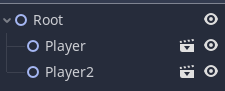

# Godot(Guh Doh) Guide
This is some very basic godot knowledge to quickly understand some of the basics. If you are interested I highly recommend reading the documentation, as it's extremely well made, and has a lot of work put into it. You can find it [Here](https://docs.godotengine.org/en/stable/)

## Editor Overview
This is what you'll see when you launch the project

At the top you have a couple main tabs, 2D, 3D, Script, AssetLib. The main one we'll be using is 2D and script.

### Scene View
On the left you can see the scene hierarchy, which is everything you have in your current scene. You can click the + to see all of the built in nodes Godot has to offer. More on nodes later

### Inspector
If you create a node in the scene view and click it, you can see and modify all of it's properties on the right hand side.

### Bottom Panel
The bottom panel holds a bunch of stuff, such as seeing debug output, animation, audio, etc. By default it's all minimized, just click it to open it up

## Scenes & Nodes
Scenes and nodes are what builds the foundation of godot

### Nodes
Nodes are the fundamental building blocks for creating a game in godot. Every given node has these attributes:
* name
* editable properties
* receives a callback to process every frame
* it can be extended (to have more functions)
* it can be added to another node as a child 
The visualize how nodes work in godot, here is a reference image

### Scenes
A Scene is composed of a group of nodes organized hierarchically (in tree fashion). Similar to a node, scenes follow these three attributes
* always has one root node
* can be saved to disk and loaded back
* can be instanced (more on that later)

In order to run a game you need to first start with a scene, later on we can see that scenes can (almost) be used like nodes!

*Note for unity people: A scene is much more like a prefab than a scene from unity*

## Instancing
As a project grows in complexity, so will the scene hierarchy, so godot has a nice way we can split all of our game components into their own little isolated scenes. To do this we use instancing! Which does like it sounds, it creates an instance of that scene.

That's neat, but how do we make new scenes and then instance them? Well first go ahead and create some nodes, something like below

Now go ahead and right click the Player node and click "Save branch as scene"

It will then ask for a name for the scene and a place to put it, feel free to name it as you please. You will now see that we can no longer see the children of our player node, and that a .tscn file has appeared in our filesystem

First let's drag Player.tscn onto our root node to make it a child and "instance" it. As you can see, it will make a "Player2" Node, and you can do this as much as we want.

What happens if we wanted our player to now dual wield and have 2 weapons? Well we can go into the scene and modify it, we can either double click "Player.tscn" in our file system or click the movie clip icon next to our player and you will get something like below.

As you can see our root node is now the root node we saved for our scene, and another tab is opened next to our main scene. It shows that these are two isolated parts of our game, and we use instancing to use them together. Why would you want to make a scene and instance it? Well if we have 100 instances of something, and we want to change the color of it, we would just change it in our base player scene, and it will be updated to all instances of that scene.

## Scripting

Scripting in godot is done in GDScript, which is a python-like language with some godot flavor added in. Every node can have exactly one script, promoting each component doing only one thing.

### Creating a script

To create a script, right click a node and click "Attach Script".

And then give it a path and name

This will create and attach the script to the node, you can access the script by clicking the little scroll icon next to the node 

You will get something like this when you open it

The first line will be "extend \<Node>" where \<Node> is whatever node you attached the script onto (Node2D, Physics, etc)

And then you have a function called _ready() which contains pass, which just denotes to do nothing.

*Note: All godot called functions will start with _*

## General Scripting Guide

Scripting in godot, is a large topic despite it's basic syntax, it has a lot of nuance, instead of talking about it here, those interested should read these pages as the docs for godot are excellent.
 
* [Basic Scripting](https://docs.godotengine.org/en/stable/getting_started/step_by_step/scripting.html)
* [Advanced Scripting](https://docs.godotengine.org/en/stable/getting_started/step_by_step/scripting_continued.html)
* [Signals](https://docs.godotengine.org/en/stable/getting_started/step_by_step/signals.html)